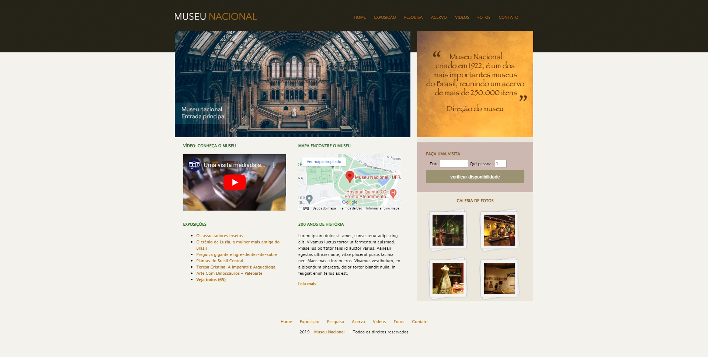

<h1 align="center"> Museu Nacional </h1>

Venha visitar nosso museu e conhecer os itens mais raros e antigos já descobertos.

 

  

## ✔ Tecnologias

Esse projeto foi desenvolvido com as seguintes tecnologias:

- HTML e CSS
- Git e Github

## 💻 Projeto

O site Museu Nacional é um site construido para fins didáticos, iniciando com as técnologias HTML e CSS

